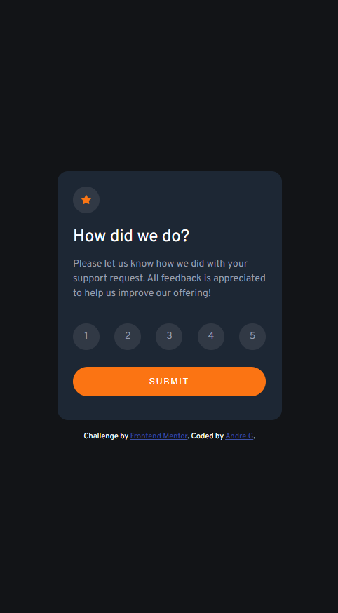

# Frontend Mentor - Interactive rating component solution

This is a solution to the [Interactive rating component challenge on Frontend Mentor](https://www.frontendmentor.io/challenges/interactive-rating-component-koxpeBUmI). Frontend Mentor challenges help you improve your coding skills by building realistic projects. 

## Table of contents

- [Overview](#overview)
  - [The challenge](#the-challenge)
  - [Screenshot](#screenshot)
  - [Links](#links)
- [My process](#my-process)
  - [Built with](#built-with)
  - [What I learned](#what-i-learned)
  - [Continued development](#continued-development)
- [Author](#author)

**Note: Delete this note and update the table of contents based on what sections you keep.**

## Overview

### The challenge

Users should be able to:

- View the optimal layout for the app depending on their device's screen size
- See hover states for all interactive elements on the page
- Select and submit a number rating
- See the "Thank you" card state after submitting a rating

### Screenshot

### Links

- Solution URL: https://github.com/Xephna/interactive-rating-component-main
- Live Site URL: https://xephna.github.io/interactive-rating-component-main

## My process

### Built with

- HTML
- CSS
- Flexbox
- Javascript
- Mobile-first workflow

### What I learned

CSS code got messy really quickly. 

### Continued development

Need to be more aware of top down approach when planning styling, so that less code is repeated. Need to refrain from jumping around the elements, should plan carefully from top down.

## Author

- Website - [work-in-progress](work-in-progress)
- Frontend Mentor - [@Xephna](https://www.frontendmentor.io/profile/Xephna)
- Twitter - [work-in-progress](work-in-progress)
